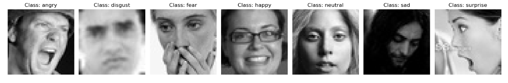
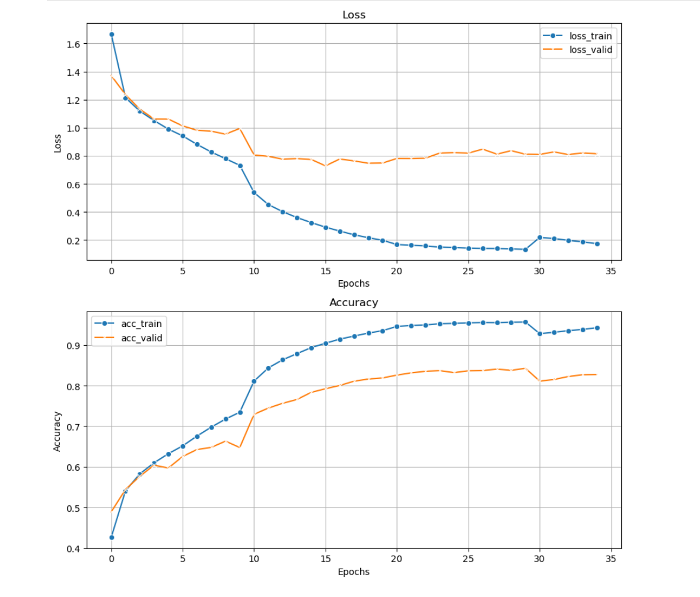
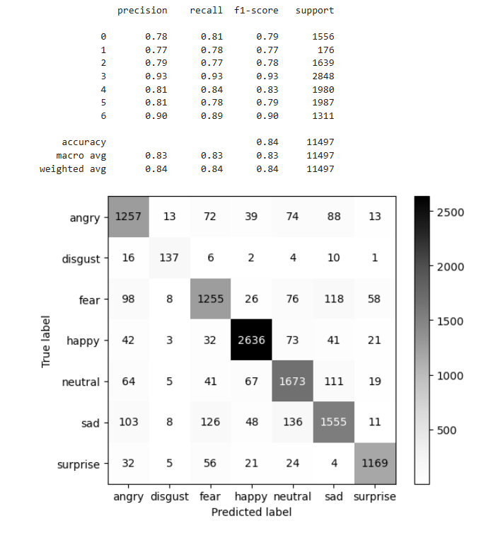
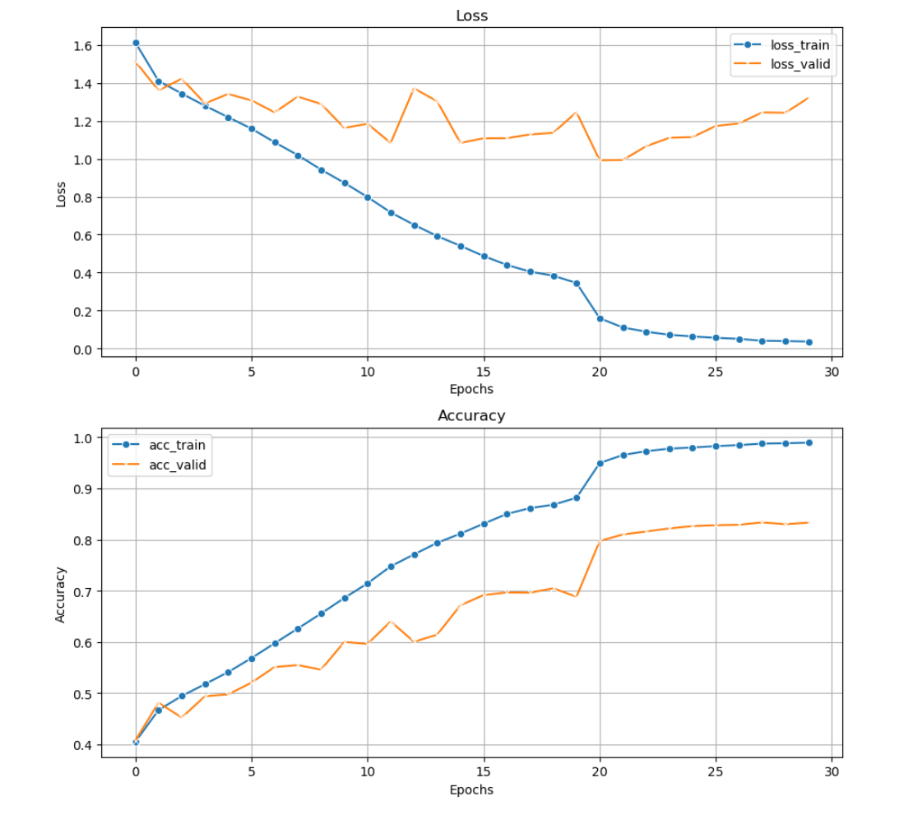
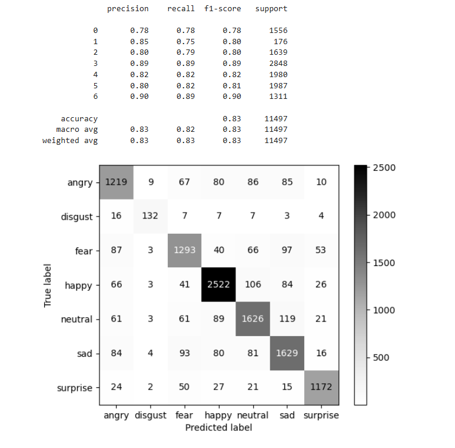

# Emotion Recognition Project (Part1)

This is the first part of my educational project on Emotion Recognition.
The project focuses on fine-tuning two CNN models: EfficientNet_B0 and ResNet-18 for facial emotion recognition.
To improve the models' generalization, I merged two datasets: FER-2013 by Manas Sambare and Face Expression Recognition Dataset by Jonathan Oheix from Kaggle.
As a result, I obtained 74,000 grayscale images of size 48x48.

During training, I applied data augmentation techniques such as RandomHorizontalFlip to enhance performance

---

## Datasets:
- FER-2013 by Manas Sambare: https://www.kaggle.com/datasets/msambare/fer2013
- Face Expression Recognition Dataset by Jonathan Oheix: https://www.kaggle.com/datasets/jonathanoheix/face-expression-recognition-dataset/data

#### Visualisation of merge datasets

---

## Project structure

 
 - "models/" : Fine-tuned models weights
 - "notebooks/" : Include the main training notebook and helper functions
 - "results/" : Contain images for this file
---

## Results

### EfficientNet_B0:
 - Test Loss: 0.82
 - Test Accuracyy: 0.84
 
#### Train and Validate Loss

#### Classification report and Confusion matrix

### ResNet-18:
 - Test Loss: 1.40
 - Test Accuracyy: 0.83

#### Train and Validate Loss

#### Classification report and Confusion matrix

#### **Comprasion**: EfficientNet_B0 showed slightly better perfomance than ResNet-18

---

## Future Work:
 - Make a model for real-time recognition

---

## Tolls and Libraries
 - Python
 - Pytorch
 - Jupyter Notebook
 - Seaborn, Matplotlib